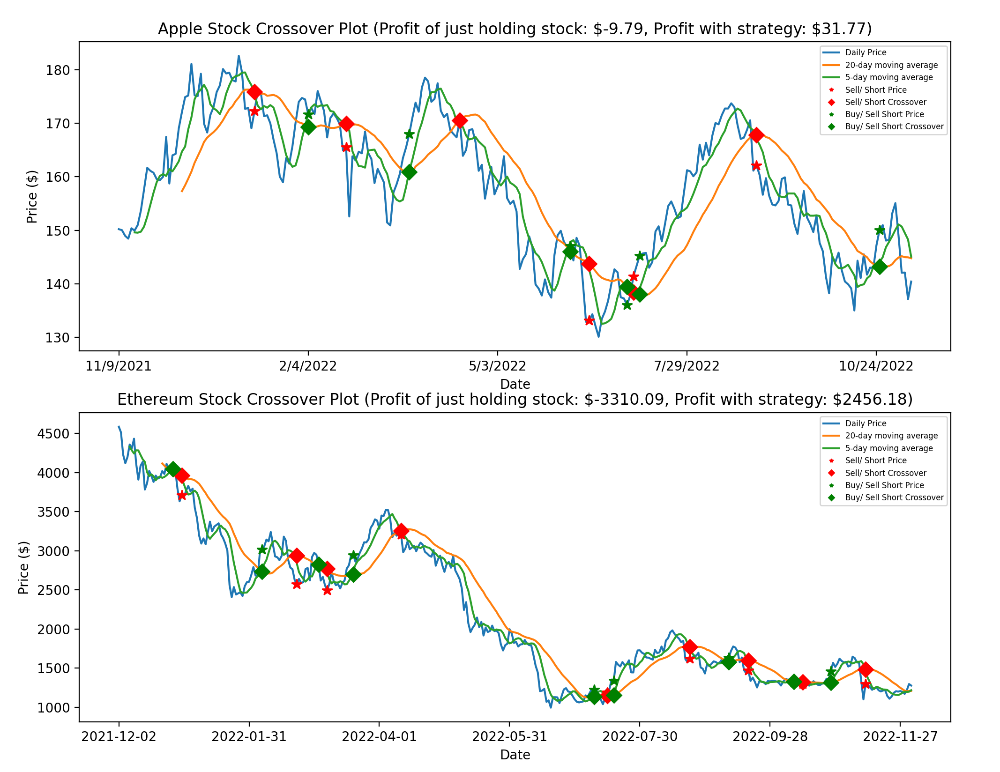

# crossover_trading_strategy_backtesting
Back-testing crossovers stock-trading strategy to create buy/ sell signals on daily/ minute OHCL data based on intersection of short term/ long term moving averages.

## Trading strategy details

Cross-over trading creates buy and sell signals on the intersection of the short-term and long-term moving average of an asset's price. The general idea is that if the 
short-term moving average moves above the long-term moving average that the asset price has an upwards momentum and would therefore be a good opportunity to buy.
Similarly, a short-term moving average moving below the long-term moving average signifies that recent price movements have gone below the typical long-term price and
would signal a downturn in price momentum, meaning the asset should be sold. This essentially allows a trader to possibly ride the gains but not the losses, allowing to profit solely off prices rising and minimizing loss. Initially plotting the strategy, I realized that possible losses came from high frequency
intersections in which the long-term moving average and short-term moving average move very close to one another and thus create short intersections that are not truly 
representative of the momentum in asset price. This creates a risk of loss as prices can rise sharply but then decline sharply much more creating a buy signal and a sell
signal but only once the asset's price has fallen below buy price. While on the day-by-day cross-over strategy this risk is not as present since prices fluctuate less
violently and frequently, but if trying to trade on a higher frequency such as minute-by-minute where profits are very small amounts, these small losses can accumulate
and significantly lessen profits, even to potential loss. To address this, I implement a stop-loss and re-buy signal in the minute-by-minute trading simulator which
sells the asset following a buy indicator if the price falls .1% below the buy signal price, and re-buys the asset if the price goes above .1% from that buy-signal. This 
strategy aims to eliminate the minor losses created by faulty buy signals, with the assumption that significant gains will have enough momentum for the asset not to fall .1% below buy signal and also re-buy the asset if the .1% drop was just a minor drop. The code in this file plots a day-by-day cross-over trading strategy while the minute-by-minute trading simulator simulates the trading strategy as prices are read in as if in live-feed and prints out buy/ sell/ stoploss/ re-buy signals at timestamps and calculates net profits.

## Day-by-day crossover trading plot for Apple Inc. and Ethereum

